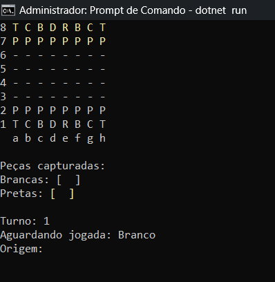

### Xadrez em Console

Com entuito de treinar orientação de objetos em c# foi desenvolvido um programa gamificado em console do jogo Xadrez. O código está aberto, basta executar o comando abaixo na pasta principal do arquivo, através do prompt de comando ou terminal de sua preferência.

    dotnet run

 
